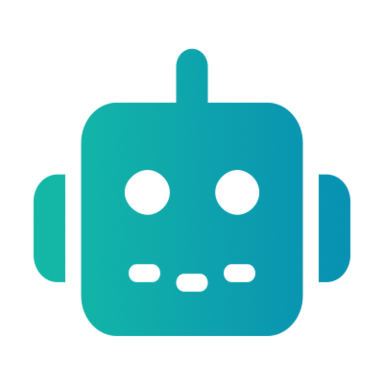

# DocsBot

Manage DocsBot workspaces from Claude. Inspect teams, bots, knowledge sources, question history, reports, and integrations. The included workflow skill helps you build bots, improve answers, prepare voice instructions, and evaluate response quality using the permissions already granted to your DocsBot account.

## Connect your account

Connect the remote DocsBot server at https://mcp.docsbot.ai through Claude's normal browser-based OAuth flow. Do not paste passwords, API keys, or OAuth tokens into chat. DocsBot checks your current team role and bot access for each action. You can revoke authorized MCP clients in DocsBot's API & Integrations dashboard.

This release requires the server with predefined named tools such as `list_teams`, `list_bots`, `get_bot`, and `update_bot`. Refresh the client's MCP tool list after installing an update. If the server still exposes the older Admin `search`/`execute` dispatcher, complete the server migration before using this release.

## What it runs and where data goes

The package contains workflow instructions, reference documents, and a remote MCP configuration. It includes no local MCP server, executable hook, package launcher, or credential. Normal tool requests go to the declared DocsBot connector at https://mcp.docsbot.ai. Tool inputs can include team and bot identifiers, settings, source URLs, source content, and the details needed for the requested administrative operation. Results can contain account names, team members and email addresses, source content, lead details, and bot question or conversation history, subject to your permissions.

When you authorize a document upload, the workflow first requests a signed upload URL through DocsBot, then sends the selected file bytes by HTTP PUT to DocsBot-managed private cloud storage. That storage is internal DocsBot service infrastructure, including when the cloud provider hosts it. The upload uses the authorized signed URL rather than the MCP request channel. Only the selected file is uploaded; signed URLs must remain private. This is optional and occurs only for the requested source-upload workflow.

The bundled workflow uses the declared DocsBot connector and DocsBot-managed internal infrastructure. It does not send workspace data to an undeclared external service. At your request, DocsBot can inspect a public website for branding or source selection, or configure a bot with external MCP servers, integrations, or webhooks. Those are actions performed or configured through the declared DocsBot service, and the bot or service can contact destinations you explicitly select. Their behavior and data sharing depend on that configuration and the permissions you approve.

DocsBot uses service providers to host and process authorized service data; see the current privacy policy and subprocessor list. This plugin does not require access to unrelated Claude chats, memory, or local files. Files are used only when you select them for the requested task.

## Stored data and approvals

The plugin reads and writes service data. Requested changes such as bot instructions, source content, member details, lead data, or integration settings can persist in your DocsBot account for longer than 30 days. Retention depends on the data type, account settings, and service policy. Do not describe this plugin as storing no data or retaining everything for less than 30 days.

Review destructive, costly, sensitive, and access-changing actions before authorizing them. Voice instructions can be prepared during bot setup, while advanced voice is enabled only when the user explicitly requests it or their context clearly authorizes voice. Subscription upgrades and payment or commerce changes are outside this plugin.

This administration plugin is intended for adult workspace administrators and bot builders.

## Links

- [Documentation](https://docsbot.ai/documentation/developer/mcp-server)
- [Privacy](https://docsbot.ai/legal/privacy-policy)
- [Terms of service](https://docsbot.ai/legal/terms-of-service)
- [Support](https://docsbot.ai) - human@docsbot.ai
- [Source repository](https://github.com/uglyrobot/docsbot-agent-skills)

Licensed under MIT. See LICENSE.
